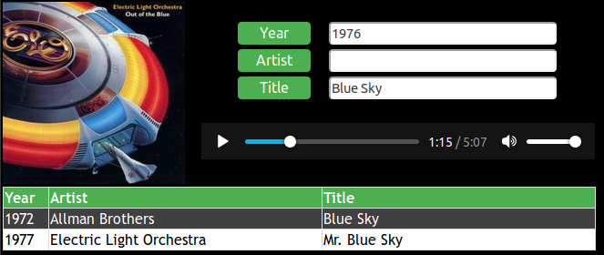

# chron_player
MP3 Browser/Player For HTML5 Browsers

It's called chron_player because I wanted to browse my music according to year, but also by title and artist.

A simple MP3 player that uses a xml database.  It does not need running server since it uses a local xml file as its database.
This also includes a quick-and-dirty way of reading the cover art from an MP3 file with ID3v2 tags.  After spending a weekend 
of scanning forums and coding a full-blown tag reader, I realized I didn't need it.  I just looked for the image/jpeg string
and grabbed the data bytes of the image that followed.  Then, I encoded the image into a DataUrl and displayed it.  One sneaky
trick: some JPEG markers contain a null byte after the FF.  These need to be ignored.



Instructions:
1. put chron_player.html in the top-level directory of your library
2. create an xml file of your songs that has the tags "year", "Artist", "Title", and "File".  Put this xml file in
the same directory as chron_player.html. See example below.  Also, you need to encode characters like &.  
3. The files must be in the same directory as chron_player.html or subdirectories.

example xml file:
```
<?xml version="1.0"?>
<chron>
<song>
<year>1975</year>
<Artist>10cc</Artist>
<Title>I'm Not In Love</Title>
<File>1975 - 10cc - I'm Not In Love.mp3</File>
</song>
<song>
<year>1977</year>
<Artist>10cc</Artist>
<Title>The Things We Do For Love</Title>
<File>1977 - 10cc - The Things We Do For Love.mp3</File>
</song>
</chron>
```
Limitations:
-Only works for embedded jpegs.
